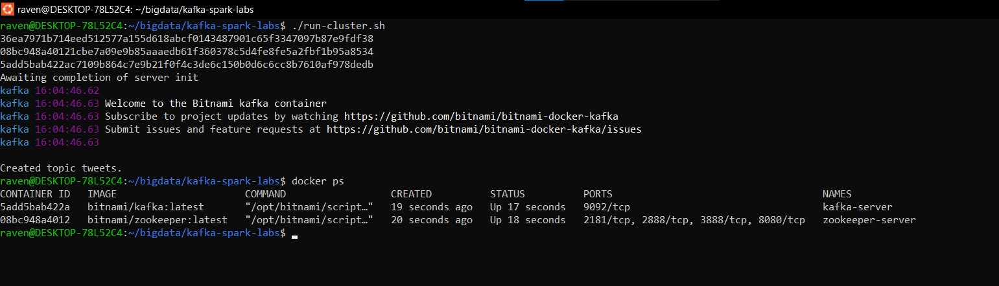
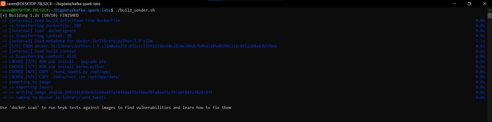
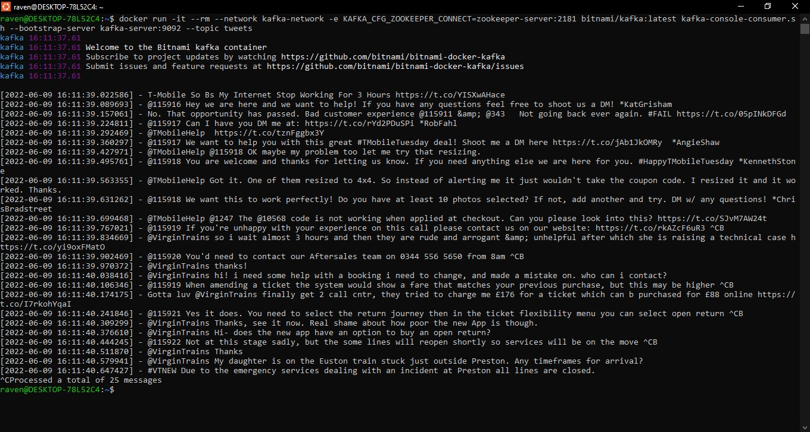
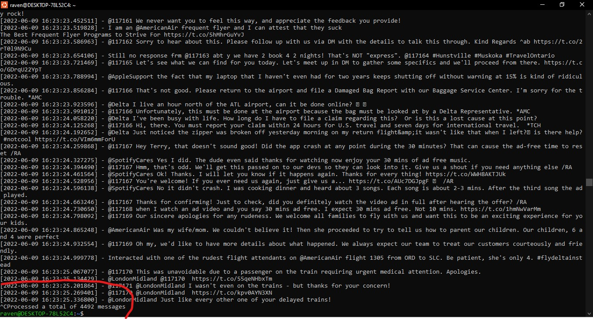

# Lab 6: Writing to Kafka with code

### Disclaimer

`data/twcs.csv` was not uploaded due to its large size. Download it to replicate the results.

### Report

Running the cluster still looks the same as in the previous lab:

Of course, to shut it down you can run `shutdown-cluster.sh`.

---

With `build_sender.sh` you can buld and run the producer program.

---

Finally, the output from the console consumer client is correct:

And leaving it up for ~5 minutes doesn't break it.

