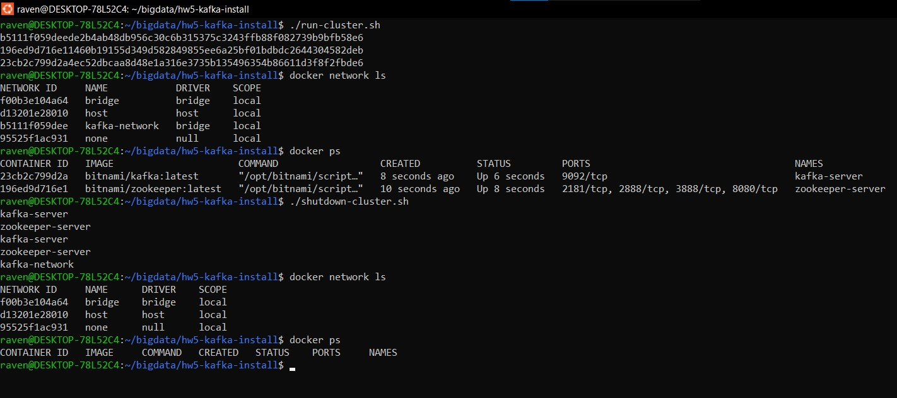
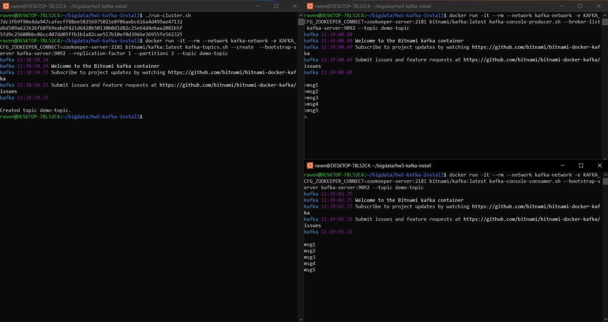

# Lab 5: Kafka installation

### Report

Running and shutting down the clusters is done via `run_cluster.sh` and `shutdown-cluster.sh`:

Using the installation to create a topic and then sending 5 messages via it is done as follows:

