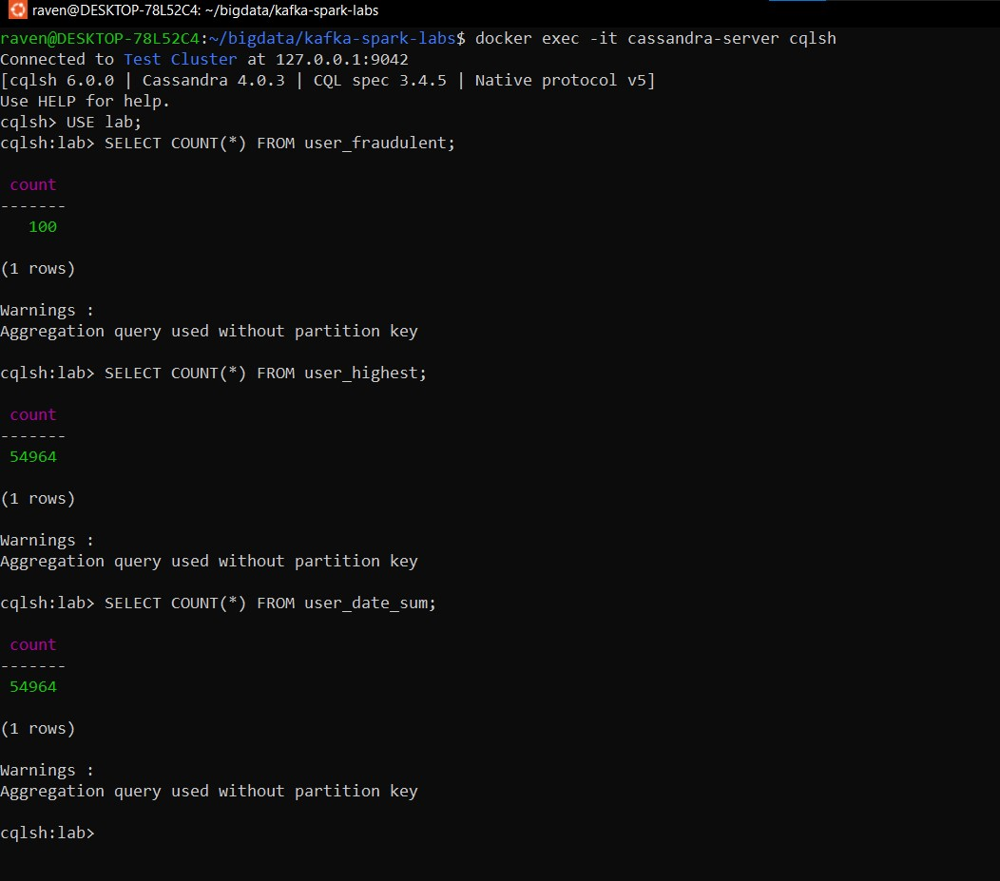
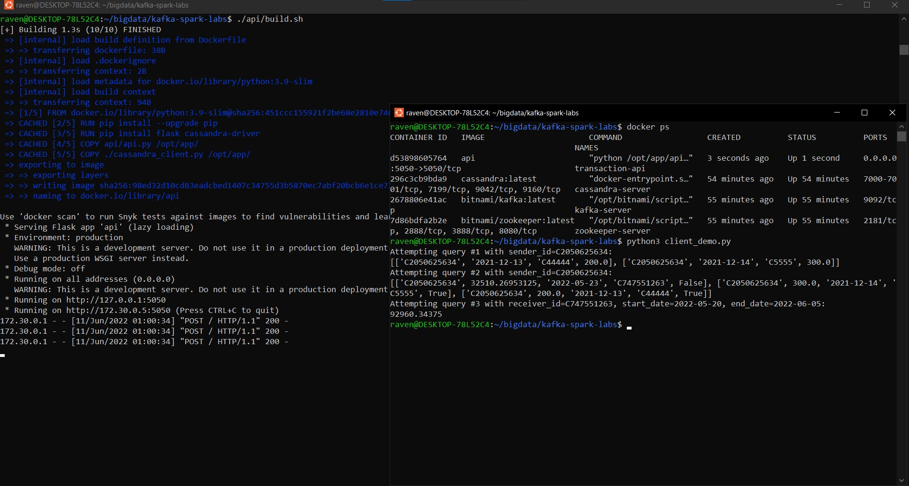

# Lab 7: Reading from Kafka with code

### Disclaimer

I did not upload `sender/data/data.csv` to GitHub. Put the data at that path to replicate the results.

### Report

Building and running the containers:

Record counts in Cassandra after running the containers for 30+ minutes:

You can see that the `user_fraudulent` table has far less entries - since it only contains fraudulent transactions.

---

When running the demo, I couldn't find a sender that had multiple transactions to his name (even though the data was accumulating for 30+ minutes). I found such a user later (you can see him in the third query), but in the first 2 queries I added some transactions artificially, so we could at least test the "top-3" idea in the 2nd query.

