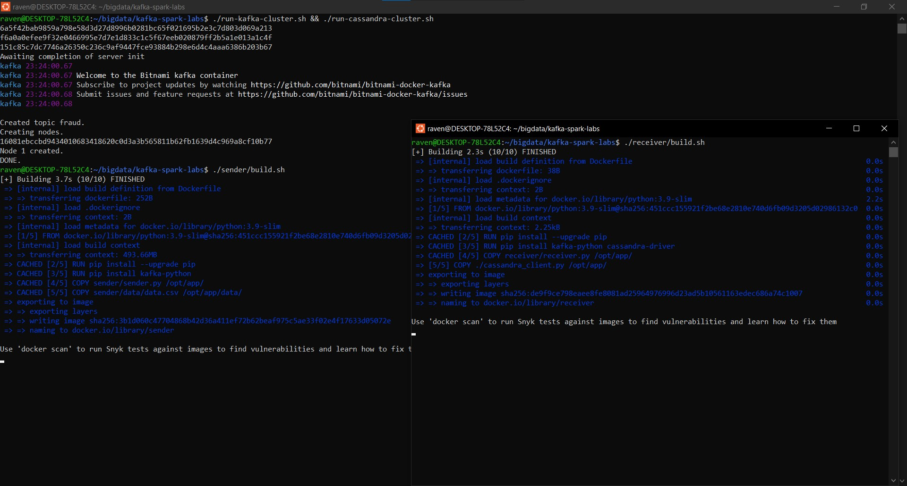
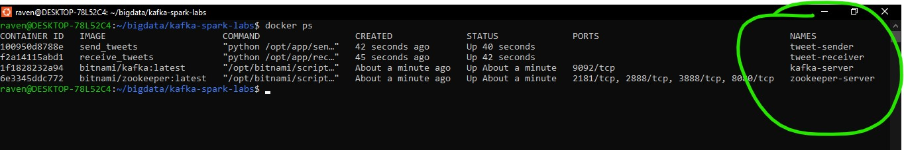
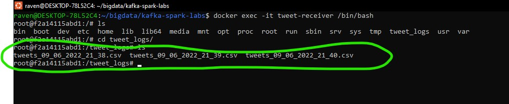
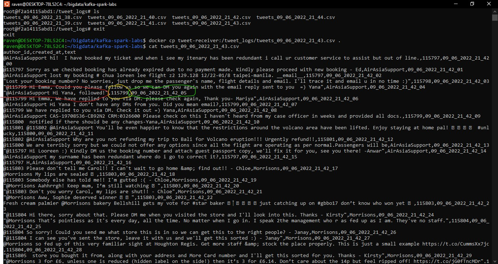

# Lab 7: Reading from Kafka with code

### Disclaimer

In the final version here on GitHub, we use `sender/data/sample.csv` instead of `sender/data/twcs.csv` because of file size constraints. In the report below, everything is demonstrated using `sender/data/twcs.csv`.

### Report

Building and running the containers:

docker ps:

Logs after a few minutes:

Finally, the content of a log file:

